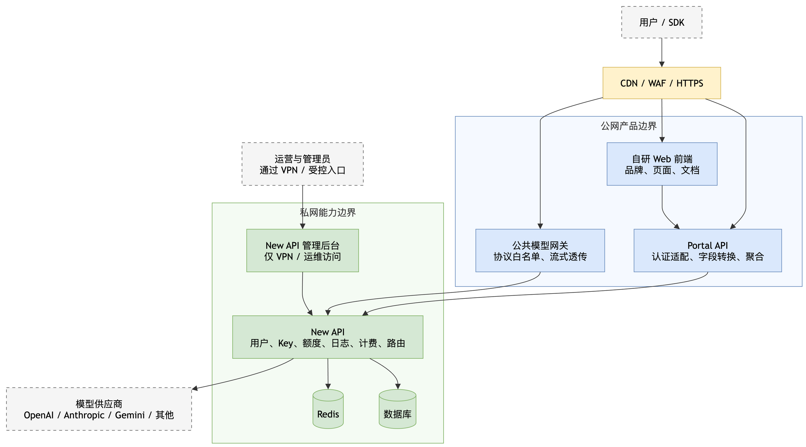

# 项目背景、目标与总体架构

## 1. 项目背景

Lang API 要建设一个可投入生产使用的大模型 API 聚合平台。平台向用户提供统一的模型调用入口、账号与余额管理、API Key、用量查询、模型价格和开发文档等能力。

项目不以练习或从零掌握所有技术为目标。核心衡量标准是：在有限开发能力和维护精力下，尽快得到可用、可运营、可逐步演进的产品。

直接部署 New API 虽然最快，但存在三个问题：

- 市面上的默认面板高度同质化，难以形成独立产品认知；
- 默认前端功能和元素较多，难以按本项目需要自由收敛；
- 将 New API 全部接口直接暴露到公网，会扩大底层实现、升级和安全风险对外部系统的影响。

完全自研又会过早承担模型协议适配、渠道路由、计费、支付、流控和安全等高风险工作。因此本项目采用折中方案：自研用户前端和接口门面，复用私网中的 New API 作为核心能力提供者。

## 2. 产品目标

### 2.1 核心目标

对外形成一个功能完整、品牌独立、信息架构独立的 API 聚合平台。用户从页面、域名、接口命名、错误格式和产品文案上，应明显感受到这是另一个网站，而不是 New API 默认面板的换色版本。

这里的“看起来由我们自己开发”具体表示：

- 使用独立的品牌、布局、组件样式、文案和交互流程；
- 不加载或链接 New API 的默认前端资源；
- 用户前端不直接调用 New API 的 `/api/*` 管理接口；
- 公网扫描不能直接发现 New API 管理端、状态端点、静态资源和默认错误页；
- 对外 Portal API 使用本项目自己的路径、字段和错误结构；
- New API 可以升级或替换，而前端契约尽量不随之变化。

该目标不表示虚假宣称所有底层代码均为原创，也不保证专业人员无法通过运行行为推测所使用的开源组件。开源许可、版权标识和商业授权必须另行满足，不能通过技术隐藏规避。

### 2.2 第一版成功标准

第一版达到以下结果即可视为“能用”：

- 用户可以注册、登录、退出并维护基本资料；
- 用户可以查看、创建、编辑、启停和删除 API Key；
- 用户可以查看余额、充值入口和充值记录；
- 用户可以查看模型与基础价格信息；
- 用户可以查看请求记录和基础用量；
- 用户可以阅读开发文档、服务条款和隐私政策；
- 用户可以通过独立 API 域名调用至少 OpenAI 兼容接口；
- New API 管理后台不直接暴露公网；
- 页面视觉和信息架构不复刻 QinghuaAPI，也不沿用 New API 默认面板。

## 3. 非目标

当前阶段明确不追求：

- 像素级复制 QinghuaAPI；
- 从零重写 New API 的渠道、路由、计费和支付能力；
- 第一版就建立完整独立账务系统；
- 第一版就实现所有 New API 功能；
- 对外提供自研管理员后台；
- 为了与参考站完全一致而阻塞已有能力上线。

## 4. 总体架构

可编辑源文件：[01_LangAPI总体架构.drawio](./assets/01_LangAPI总体架构.drawio)

### 4.1 组件职责

| 组件 | 职责 | 是否公网 |
|---|---|---:|
| 自研 Web 前端 | 首页、模型广场、文档、用户控制台和法律页面 | 是 |
| Portal API | 用户端接口门面；认证适配、字段转换、接口聚合、错误统一 | 是 |
| 公共模型网关 | 承载 OpenAI、Anthropic、Gemini 等模型调用和流式转发 | 是 |
| New API | 用户、Token、额度、日志、计费、支付、渠道和模型路由 | 否 |
| New API 管理后台 | 渠道、用户、模型、倍率、支付和系统配置 | 否，仅运维访问 |
| 数据库与 Redis | New API 持久化、缓存和多节点协调 | 否 |
| 模型供应商 | 实际模型服务 | 外部依赖 |

### 4.2 推荐域名边界

| 用途 | 示例 | 说明 |
|---|---|---|
| 用户网站 | `www.example.com` | 前端页面 |
| Portal API | `www.example.com/portal/api/*` | 推荐同源，减少浏览器 Cookie 和 CORS 复杂度 |
| 模型 API | `api.example.com` | 提供 SDK 使用的公开 Base URL |
| 运维入口 | 私网域名或 VPN 地址 | New API 默认管理后台 |

域名为占位示例，实施时统一替换。

## 5. 核心边界

### 5.1 Portal API 不是透明反向代理

禁止将 `/api/*` 整体转发给 New API。Portal API 必须采用接口白名单，并负责：

- 将自有路径映射为 New API 路径；
- 裁剪不应暴露的响应字段；
- 统一错误码、错误文案和分页结构；
- 移除底层服务标识性响应头；
- 限制请求方法、正文大小、超时和访问频率；
- 为每次请求生成统一追踪 ID；
- 隔离 New API 接口变更对前端的影响。

### 5.2 公共模型网关保持薄而稳定

模型网关主要负责网络边界和流式透传，不在第一版重复实现 New API 的模型路由和计费。它只开放明确支持的模型协议路径，不开放管理接口。

已经开始产生模型输出的请求不得由网关自动重试，否则可能造成重复调用和重复计费。

### 5.3 New API 是第一阶段业务数据权威

在独立账务系统建立前，以下数据以 New API 为准：

- 用户与登录状态；
- API Key；
- 用户额度；
- 用量与消费日志；
- 充值订单；
- 渠道、模型和倍率配置。

Portal API 第一阶段不再维护第二套余额和 Token 数据，避免双写和数据不一致。

### 5.4 管理后台只在私网使用

New API 管理后台继续原样保留，供项目运营者管理渠道、用户、定价和支付配置。它必须满足：

- 不绑定公网可达端口，或由防火墙完全拒绝公网访问；
- 仅允许 VPN、跳板机或 SSH 隧道访问；
- 不与公开模型 API 共用可探测入口；
- 数据库和 Redis 不暴露公网；
- 生产环境固定版本升级，不使用未经验证的 `latest` 漂移更新。

## 6. 产品独立性要求

产品独立性不靠简单改 Logo，而靠完整的外部契约：

- 页面导航、布局与视觉语言独立设计；
- 页面只保留当前产品真正需要的功能；
- Portal API 路径统一使用 `/portal/api/*`；
- 返回体、分页、日期和金额格式由本项目定义；
- 404、401、403、429 和 500 等响应使用统一格式；
- 不透传 New API 内部错误、版本号、域名、节点名、渠道 ID 和堆栈；
- 开发文档只描述本项目公开接口；
- SDK 示例只出现本项目域名和品牌。

## 7. 关键风险

| 风险 | 原因 | 当前策略 |
|---|---|---|
| 错把门面层当安全隔离 | 底层越权、计费或出站请求漏洞仍可能产生影响 | 私网部署、接口白名单、出站限制、及时升级 |
| New API 升级破坏适配 | 上游接口和认证契约可能变化 | Portal API 固定契约并建立上游契约测试 |
| 统计接口性能下降 | 从大量分页日志实时计算指标成本高 | 第一版简化，第二阶段建设聚合接口和缓存 |
| 账务口径不一致 | 额度、充值、消费可能来自不同记录 | 第一阶段以 New API 为唯一权威，不双写 |
| 法律条款无法追溯 | 只展示正文不能证明用户同意了哪个版本 | 第一版复用内容，第三阶段增加版本和同意记录 |
| 开源许可风险 | 技术隐藏不等于许可允许 | 商用前确认 AGPL 和品牌相关义务，必要时取得商业授权 |

## 8. 决策原则

当“更快上线”和“立即做完整架构”冲突时，采用以下原则：

1. New API 已有且足够使用：优先适配，不重写。
2. New API 有原始数据但没有目标接口：先上线简化版，第二阶段聚合。
3. New API 完全没有：确认是必要功能后最后开发。
4. 任何阶段都不得牺牲认证、支付、额度和密钥的基本安全性。
5. 参考站点用于确认用户需要什么，不用于决定代码必须怎样实现。
